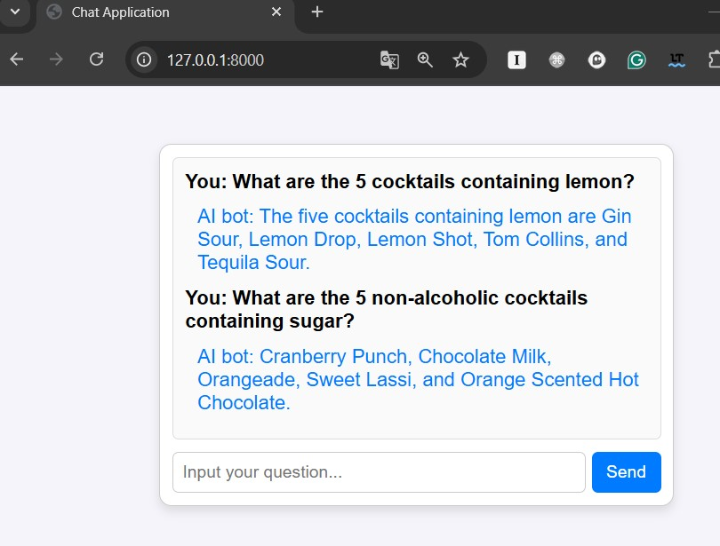
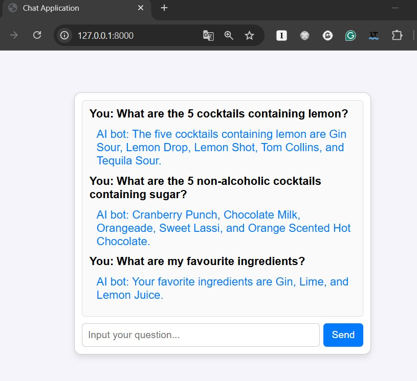

# Cocktail Advisor Chat

---
### Technology Stack:
- Python
- FastAPI
- Llamaindex
- OpenAI
- Jinja2

---

### How to Run the Project:

1. **Set up a Python virtual environment**:
   ```bash
   python -m venv .venv
   ```

2. **Activate the virtual environment**:
   - On macOS/Linux:
     ```bash
     source .venv/bin/activate
     ```
   - On Windows:
     ```bash
     .venv\Scripts\activate
     ```

3. **Install project dependencies**:
   ```bash
   pip install -r requirements.txt 
   ```

4. **Start the FastAPI application**:
   ```bash
   uvicorn main:app --host 0.0.0.0 --port 8000 --reload
   ```

   AI Chat will be accessible at [http://localhost:8000](http://localhost:8000).

---

### Settings:

** Copy .env.sample to .env & set OPENAI_API_KEY 

---

### Demo: 



